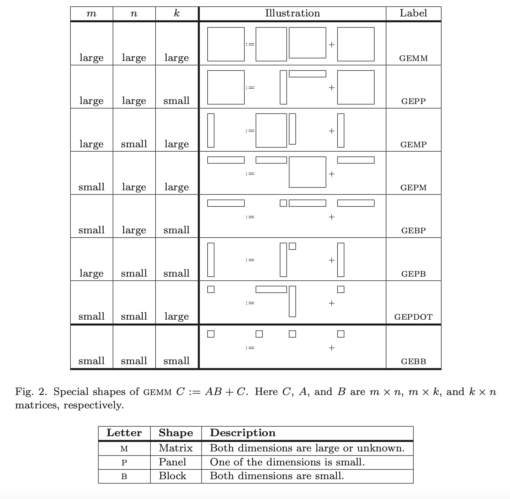
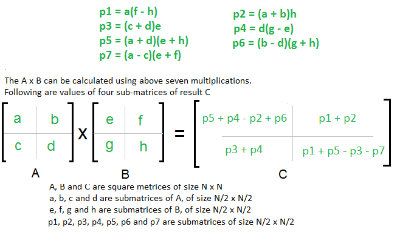

# matrix


Picked the mantle to implement matrices and matmul in Python, C, and CUDA. Then optimize the shit out of it. The inspiration is [here](https://github.com/spikedoanz/matmul). 

A [gem of knowledge](https://www.cs.utexas.edu/~flame/pubs/GotoTOMS_final.pdf), or where does these GEMM something names come from?


## TODO
- Tiled matmul
- Multithreading
- Vectorization with CPU intrinsics
- CUDA

## Performance

#### Theoritical Limit

#### Baseline 
- Numpy (multithreaded, M2 Pro): 
```
(128, 128, 128): 57.52 +/- 28.71 GFLOPS
(512, 512, 512): 253.81 +/- 25.85 GFLOPS
(1024, 1024, 1024): 274.68 +/- 56.40 GFLOPS
```
- Numpy (single thread, M2 Pro):
```
(128, 128, 128): 92.89 +/- 9.58 GFLOPS
(512, 512, 512): 100.50 +/- 8.87 GFLOPS
(1024, 1024, 1024): 104.77 +/- 2.32 GFLOPS
```
- Numpy (multithreaded, Ryzen 3600): 
```
Average FLOPS | (10x100 iterations) | multithreaded=True:
(128, 128, 128): 113.38 +/- 50.58 GFLOPS
(512, 512, 512): 30.59 +/- 14.48 GFLOPS
(1024, 1024, 1024): 112.05 +/- 20.51 GFLOPS
```
- Numpy (single thread, Ryzen 3600):
```
(128, 128, 128): 89.12 +/- 0.66 GFLOPS
(512, 512, 512): 107.86 +/- 2.25 GFLOPS
(1024, 1024, 1024): 106.82 +/- 1.46 GFLOPS
```


#### Naive
- Python (matrix.py): ~0.0004 GFLOPS (Ryzen 3600), ~0.0010 (M2 Pro)
- C      (matrix.c): 
    - Vanilla: 
      - M2 Pro: ~0.31 GFLOPS (-O0), higher optimization breaks benchmarking
      - Ryzen 3600: ~0.13 (-O0), ~0.55 (-O1), ~1.00-1.6 for small and 0.33 for large (-O2), ~1.9 small, 0.9 medium, 0.33 for large (-O3)
    - Optimization: Transpose for row-major optimized access
      - Ryzen 3600: ~0.45, 0.49, 0.49 (-O0), ~2.70, 2.58, 2.58 (-O1), same for -02, ~3.34, 2.65, 2.61 (-O3), 
  
#### Strassen:
- C      (strassens.c):
    - Vanilla:
      - Ryzen 3600: ~0.43, 0.57, 0.65 GFLOPS (-O0), ~3.10, 3.45, 3.80 GFLOPS (-O1), ~3.80, 4.20, 4.90 GFLOPS (-O3)  
    - Optimization: Transpose for row-major optimized access
      - Ryzen 3600: ~0.49, 0.61, 0.69 GFLOPS (-O0), ~3.23, 3.60, 4.20 GFLOPS (-O1), ~4.03, 4.70, 5.88 GFLOPS (-O3)


## Python

Matrices are implemented using 3D row-major strided representation. To create a Matrix object:

```python
m = Matrix(d=2, h=2, w=2, data=[i for i in range(8)])
```

Above creates a 2x2x2 matrix with 0..8 values as entries. Operations on matrices work as Python usual, `@` for matmul.

Testing Python matrix and matmul implementation:
```
python -m unittest tests.test_matrix.TestMatrix
```

## C

Same as python, 3D row-major strided representation matrices. Matrix is built with a `Matrix` struct. To access, set and matmul use: `get`, `set`, and `matmul`. To create a Matrix:

```C
Matrix A;
Matrix B;
Matrix C;

allocate_matrix_random(&A, 1, M, N);
allocate_matrix_consecutive(&B, 1, N, K);
allocate_matrix_zeros(&C, 1, M, K);
```

Naive benchmark:
```
gcc -o matmul benchmarks/naive.c -O0; ./matmul
```

Strassen benchmark:
```
gcc -o strassen benchmarks/strassen.c -O0; ./strassen
```

Profiling:
```
gcc -pg -o strassen benchmarks/strassen.c -O0; ./strassen
gprof strassens gmon.out
```

#### Python Brain

Functions overhead will kill you. 

Look at this `gprof` report (~0.13 GFLOPS):
```
Each sample counts as 0.01 seconds.
  %   cumulative   self              self     total           
 time   seconds   seconds    calls   s/call   s/call  name    
 68.36     13.57    13.57 2420113408     0.00     0.00  get
 17.88     17.12     3.55        3     1.18     6.61  matmul
 13.55     19.81     2.69 2421440512     0.00     0.00  strided_index
  0.10     19.83     0.02  1327104     0.00     0.00  set
  0.05     19.84     0.01        9     0.00     0.00  free_matrix
  0.05     19.85     0.01                             _init
  0.00     19.85     0.00        6     0.00     0.00  allocate_matrix_random
  0.00     19.85     0.00        3     0.00     0.00  allocate_matrix_zeros
```

And now with strided index, setting, and getting hardcoded in sub, and add functions (0.45 GFLOPS):
```
Each sample counts as 0.01 seconds.
  %   cumulative   self              self     total           
 time   seconds   seconds    calls   s/call   s/call  name    
 99.06      5.26     5.26        3     1.75     1.76  matmul
  0.56      5.29     0.03  1327104     0.00     0.00  set
  0.19      5.30     0.01        6     0.00     0.00  allocate_matrix_random
  0.19      5.31     0.01                             _init
  0.00      5.31     0.00  1327104     0.00     0.00  strided_index
  0.00      5.31     0.00        9     0.00     0.00  free_matrix
  0.00      5.31     0.00        3     0.00     0.00  allocate_matrix_zeros
```

Bonkers.

#### Fixing Strassen 

Initial Naive (~0.02 GFLOPS)
```
Each sample counts as 0.01 seconds.
  %   cumulative   self              self     total           
 time   seconds   seconds    calls   s/call   s/call  name    
 26.63      7.95     7.95 593362726     0.00     0.00  add
 17.92     13.30     5.35 1132783389     0.00     0.00  allocate_matrix_zeros
 17.72     18.59     5.29 377594462     0.00     0.00  sub
  9.65     21.47     2.88 107884132     0.00     0.00  split
  7.05     23.57     2.10        3     0.70     9.85  strassens
  6.60     25.55     1.97 647304798     0.00     0.00  get
  4.29     26.82     1.28 323652399     0.00     0.00  set
  4.02     28.02     1.20 1132783395     0.00     0.00  free_matrix
  3.84     29.17     1.15 970957197     0.00     0.00  strided_index
  1.24     29.54     0.37 53942066     0.00     0.00  combine
  0.67     29.74     0.20                             _init
  0.13     29.78     0.04                             matmul
  0.12     29.82     0.04                             allocate_matrix_consecutive
  0.07     29.84     0.02        6     0.00     0.00  allocate_matrix_random
  0.05     29.85     0.01                             main
```

Defaulting to vanilla matmul for matrices smaller or equal 64 (0.48, 0.58, 0.65 GFLOPS)
```
Each sample counts as 0.01 seconds.
  %   cumulative   self              self     total           
 time   seconds   seconds    calls   s/call   s/call  name    
 85.04      3.07     3.07     2751     0.00     0.00  matmul
  6.65      3.31     0.24     5038     0.00     0.00  add
  2.77      3.41     0.10     3206     0.00     0.00  sub
  2.49      3.50     0.09      916     0.00     0.00  split
  1.66      3.56     0.06 11268096     0.00     0.00  set
  0.83      3.59     0.03      458     0.00     0.00  combine
  0.28      3.60     0.01 11268096     0.00     0.00  strided_index
  0.28      3.61     0.01        6     0.00     0.00  allocate_matrix_random
  0.00      3.61     0.00     9627     0.00     0.00  free_matrix
  0.00      3.61     0.00     9621     0.00     0.00  allocate_matrix_zeros
  0.00      3.61     0.00        3     0.00     1.20  strassens
```

## Strassens Algorithm for Matrix Multiplication (or how to cheat complexity with clever algebra)

So the typical time complexity of matrix multiplication is $O(n^3)$, divide and conquer than Strassens is based on is also $O(n^3)$. What is the catch then? Turns out that we can be smart about the algebraic computations, and reduce the number of recursive calls from 8 to 7, bringing the time complexity down to $O(n^(2.81))$.



## Reading

- great read: https://salykova.github.io/matmul-cpu
- obvious read: https://siboehm.com/articles/22/CUDA-MMM
- Efficient matmul on CPU: https://www.cs.utexas.edu/~flame/pubs/GotoTOMS_final.pdf
- SIMD intro: https://www.codeproject.com/Articles/874396/Crunching-Numbers-with-AVX-and-AVX
- ARM instructions (suppossedly M series too): https://developer.arm.com/documentation/dui0801/l/A64-SIMD-Vector-Instructions/A64-SIMD-Vector-instructions-in-alphabetical-order
- amazing website as a whole: https://en.algorithmica.org/hpc/cpu-cache/associativity/

## Scratch

#### Cache
- CPU has 2-3 Caches, L1 fastest, and smallest, L2...
- L cache is extra fast, like few nanoseconds, while RAM access is ~100-200ns
- Cache contains memory bits that your CPU thought would be useful to you (prefetcher), or you used recently
- CPU check for the thing it needs in L1, then L2, L3, and RAM, if it goes up to RAM, then it fetches cache line/cache blocks, which are more than you needed, but take into account that if you needed this, you may need more from nearby, it gets places in one of L caches
- Everytime CPU doesn't find something in the cache level, it's called a *Cache Miss*, if CPU finds it - *Cache Hit*, Cache Misses stack for each search, so if the thing is in none of L1-L3 caches, then you have 3 misses in one search
